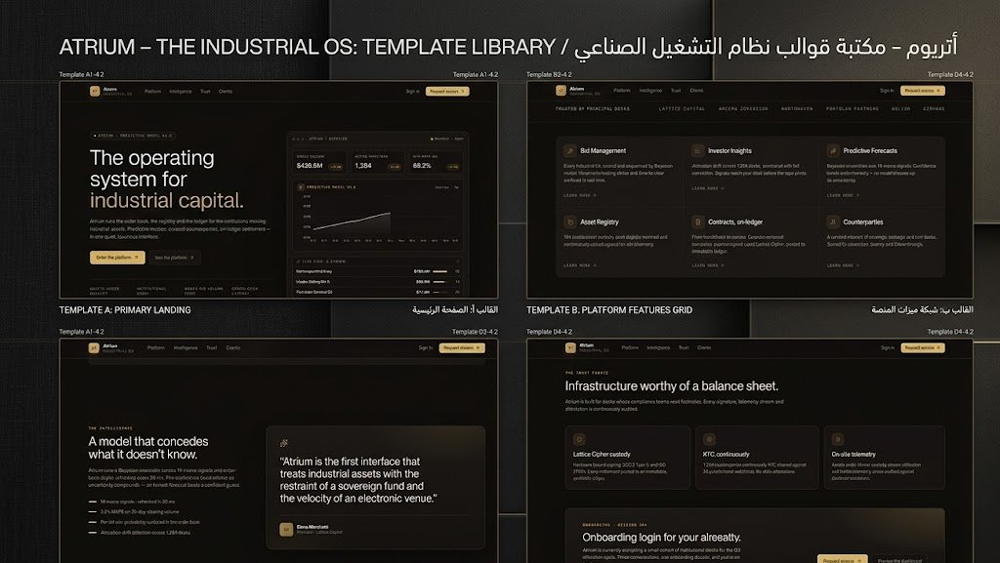

# 🏭 نظام Atrium — المنصة الشاملة لرأس المال الصناعي

<div align="center">



**نظام تشغيل متكامل لإدارة الأصول الصناعية، العطاءات، والتنبؤات الاستثمارية**

[](https://nextjs.org)
[](https://react.dev)
[](https://www.typescriptlang.org)
[](https://tailwindcss.com)

</div>

---

## 📌 نظرة عامة

**Atrium Industrial OS** هو قالب متقدم يدمج بين:

- **صفحة هبوط تسويقية فاخرة** — واجهة تسويقية راقية مع تدرجات إضاءة ديناميكية
- **لوحة تحكم مؤسسية متكاملة** — نظام يبدو كنظام تشغيل متكامل لإدارة الأصول الصناعية والمالية

يستهدف القالب المؤسسات المالية، صناديق الاستثمار السيادية، وشركات الطاقة والبنية التحتية التي تحتاج إلى واجهة احترافية عالية المستوى.

---

## 📸 معاينة المشروع

| صفحة الهبوط | لوحة التحكم |
|:-----------:|:-----------:|
|  |  |


---

## 🚀 المميزات الرئيسية

### 🎨 التصميم والواجهة
- **صفحة هبوط فاخرة** — تدرجات إشعاعية دقيقة وعناصر واجهة تعكس الثقة والموثوقية المؤسسية
- **تأثير الزجاج (Glassmorphism)** — حدود رفيعة وخلفيات شفافة لعمق بصري احترافي
- **ميكرو-تفاعلات** — تأثيرات حركية دقيقة تجعل الواجهة حيّة وتفاعلية
- **نظام ألوان OKLCH** — دقة لونية عالية بذهبي مطفأ وفحمي داكن

### 📊 وظائف لوحة التحكم
- **إدارة العطاءات اللحظية** — جدول مباشر لمتابعة 14+ عطاءً صناعياً نشطاً
- **نموذج التنبؤ بالذكاء الاصطناعي** — رسم بياني يتنبأ بحجم التسوية على مدى 5 أسابيع
- **بطاقات مؤشرات الأداء (KPI)** — 4 مؤشرات رئيسية مع رسوم بيانية صغيرة (Sparklines)
- **رؤى المستثمرين** — تحليل مرجح حسب قيمة الأصول المُدارة (AUM)
- **سجل الأصول الذكي** — متابعة الأصول مع إحصائيات دقيقة

### 🔒 الأمان والامتثال
- **نظام Trust Fabric** — واجهة تُوحي بالأمان والتشفير (Lattice Cipher)
- **جاهز للامتثال** — مصمم لمعايير SOC 2 و ISO 27001
- **Auth Ready** — يدعم إضافة Middleware للمصادقة على مسار `/dashboard`

---

## 🛠️ التقنيات المستخدمة

| التقنية | الإصدار | الغرض |
|---------|---------|--------|
| **Next.js** | 16.2 | إطار العمل الرئيسي (App Router) |
| **React** | 19 | مكتبة واجهة المستخدم |
| **TypeScript** | 5.7 | لغة البرمجة المكتوبة بالأنواع |
| **Tailwind CSS** | v4 | نظام التصميم والتنسيق |
| **Radix UI** | متعدد | مكونات واجهة المستخدم الأساسية |
| **Recharts** | 2.15 | الرسوم البيانية التفاعلية |
| **Lucide React** | 0.564 | مكتبة الأيقونات |
| **next-themes** | 0.4.6 | إدارة الثيم (ليلي/نهاري) |
| **Vercel Analytics** | 1.6.1 | تحليلات الأداء |

---

## ⚙️ طريقة التشغيل

### المتطلبات المسبقة

- **Node.js** الإصدار 18.17 أو أحدث
- **pnpm** (موصى به) أو **npm** أو **yarn**

### خطوات التثبيت

**1. تثبيت الحزم:**

```bash
# باستخدام pnpm (الموصى به)
pnpm install

# أو باستخدام npm
npm install
```

**2. تشغيل خادم التطوير:**

```bash
# باستخدام pnpm
pnpm dev

# أو باستخدام npm
npm run dev
```

**3. معاينة المشروع:**

افتح متصفحك وانتقل إلى:
```
http://localhost:3000          ← صفحة الهبوط
http://localhost:3000/dashboard ← لوحة التحكم
```

### أوامر المشروع الكاملة

```bash
pnpm dev      # تشغيل خادم التطوير
pnpm build    # بناء نسخة الإنتاج
pnpm start    # تشغيل نسخة الإنتاج
pnpm lint     # فحص جودة الكود
```

---

## 📁 هيكل المشروع

```
├── app/
│   ├── layout.tsx              # التخطيط الجذري (خطوط + metadata)
│   ├── page.tsx                # صفحة الهبوط الرئيسية
│   ├── globals.css             # متغيرات CSS والألوان والتأثيرات
│   └── dashboard/
│       ├── layout.tsx          # تخطيط لوحة التحكم
│       ├── page.tsx            # صفحة النظرة العامة
│       ├── assets/             # سجل الأصول
│       ├── bids/               # إدارة العطاءات
│       ├── contracts/          # العقود
│       ├── counterparties/     # الأطراف المقابلة
│       └── insights/           # رؤى المستثمرين
│
├── components/
│   ├── dashboard/
│   │   ├── sidebar.tsx         # الشريط الجانبي للتنقل
│   │   ├── topbar.tsx          # الشريط العلوي
│   │   ├── page-header.tsx     # رأس الصفحة والتذييل
│   │   ├── kpi-cards.tsx       # بطاقات مؤشرات الأداء
│   │   ├── predictive-chart.tsx # الرسم البياني التنبؤي
│   │   ├── bid-management.tsx  # جدول العطاءات
│   │   └── investor-insights.tsx # رؤى المستثمرين
│   ├── marketing/
│   │   ├── site-nav.tsx        # تنقل صفحة الهبوط
│   │   └── hero-preview.tsx    # القسم التمهيدي (Hero)
│   ├── ui/                     # مكونات Radix UI المخصصة
│   └── theme-provider.tsx      # موفر الثيم
│
├── hooks/                      # خطافات React المخصصة
├── lib/
│   └── utils.ts                # دوال مساعدة (cn)
└── public/                     # الملفات الثابتة
```

---

## 📖 التوثيق التفصيلي

للحصول على دليل استخدام وتخصيص كامل باللغة العربية، راجع:

- 📄 **[DOCUMENTATION_AR.md](./DOCUMENTATION_AR.md)** — الدليل التقني الشامل خطوة بخطوة
- 🏗️ **[TECHNICAL_ARCHITECTURE.md](./TECHNICAL_ARCHITECTURE.md)** — الهيكلية التقنية والمعمارية

---

## 🌐 النشر

أسرع طريقة للنشر هي عبر [Vercel](https://vercel.com):

```bash
# تثبيت Vercel CLI
npm install -g vercel

# النشر بأمر واحد
vercel --prod
```

أو اربط مستودع GitHub الخاص بك مباشرةً عبر [vercel.com/new](https://vercel.com/new).

---

## 📄 الترخيص

هذا المشروع مرخص بموجب [رخصة MIT](./LICENSE).

---

<div align="center">

**صُنع بدقة واحترافية لأعلى معايير واجهات المؤسسات المالية**

*Atrium Industrial OS · الإصدار 4.2.1*

</div>
